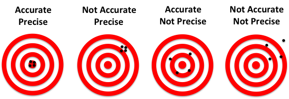

```{r setup, include=FALSE}
library(ggplot2)
library(reshape2)
library(gridExtra)
#knitr::opts_chunk$set(dev = 'pdf')
```

## Syllabus

We will recap the following topics, which should be known to successfully participate in the module **Quantitative Methods**:

- Probability
- Random variable, sample, and sampling
- Parameter estimation
- Probability distributions
- Null hypothesis significance testing
- Correlation

# Probability

## Probability

Probability is a measure of the likelihood that an event $a$ will occur, given all possible events $A$:

$P(a) = \frac{\text{Count of a}}{\text{Count of A}}$

**Example:** The probability of getting a six when rolling a dice once is $P(6) = 1/6$.

## Probability

We can also calculate the probability that event $a$ or event $b$ will occur, given they are mutually exclusive, by adding their individual probabilities:

$P(a \cap b) = P(a) + P(b)$

**Example:** The probability of getting a six or a three when wolling a dice once is $P(6  3) = P(6) + (6) = 1/6 + 1/6 = 1/3$

## Probability

When we are interested in the probability that event $a$ will occur followed by event $b$, given the events are independent, we calculate the probability by multiplying the individual probabilities:

$P(a \cup b) = P(a) * P(b)$

**Example:** The probability of getting two times a six when rolling a dice two times is $P(6 \cup 6) = P(6) * P(6) = 1/6 * 1/6 = 1/36$

## Conditional probabilities

Assume we have an urn with 30 balls in it. Of the 30 balls, 10 are wooden and 20 are made out of plastic. From the 20 balls made out of plastic, 8 are of red color and 12 are of blue color. From the wooden balls, 4 are of red color and 6 are of blue color.

What is the probability of drawing ...

- a red ball $P(R)$
- a wooden ball $P(W)$

Moreover, what is the probability of drawing...

- a red, wooden ball: $P(W \cap R)$
- a blue ball made out of plastic $P(P \cap B)$ 

## Contingency-table

We can easily represent all possible events in a contingency-table:

 |         | Red | Blue | Sum   |
 |---------|-----|------|-------|
 | Wood    | 4   | 6    | 10    |
 | Plastic | 8   | 12   | 20    |
 | Sum     | 12  | 18   | 30    |

## Contingency-table

The probabilities of each event are:

 |         | Red | Blue | Sum   |
 |---------|-----|------|-------|
 | Wood    | $P(R \cap W)=\frac{4}{30}$ | $P(B \cap W)=\frac{6}{30}$ | $P(W)=\frac{10}{30}$|
 | Plastic | $P(R \cap P)=\frac{8}{30}$ | $P(B \cap P)=\frac{12}{30}$ | $P(P)=\frac{20}{30}$ |
 | Sum     | $P(R)=\frac{12}{30}$ |$P(B)=\frac{18}{30}$ | |

## Conditional probability

While drawing a ball from the urn, we already feel that the ball is made of wood. What is the probability that it is red in color? Easy to calculate using the rule of conditional probabilities:

$P(R|W) = \frac{P(R \cap W)}{P(W)} = \frac{\frac{4}{30}}{\frac{1}{3}} = 0.4$

# Random variable, sample, and sampling

## Random variables

A random variable is a variable that can take on a set of possible values, each with an distinct probability.

**Example:** The random variable 'age' can take any value between 0 and $\infty$, though picking a random person, it is more likely she is 35 than 110. 

## Sample

Simply speaking, a sample consists of a set of realisations of a random variables. The size of a sample is termed $n$.

**Example:** If I pick one person ($n = 1$) in this class, a realisation of the random variable 'age' might be $S = \{26\}$. If I pick three persons ($n = 3$), the realizations might be $S = \{22, 28, 32\}$.

## Sampling

Drawing a sample from a population requires a defined procedure: 

- Simple random sampling
- Systematic sampling
- Stratified sampling
- Clustered sampling

All those procedures have in common that each data point has a well-defined probability of being included in the sample. We then speak of a probability sampling design. There are also non-probability sampling designs.

## Describing a sample

Suppose that we sampled the DBH (diameter at breast height) of 150 pine trees randomly selected within a forest in Brandenburg.

We can inspect the sample using a histogram.

```{r echo=FALSE, results='asis', warning=FALSE, message=FALSE, fig.height=3, fig.width=3, fig.align='center'}
set.seed(667) # One step ahead of the devil!
dbh <- data.frame(Sample = 1:150, DBH = rnorm(150, 55, 15), Forest = rep("Forest A", 150))

ggplot(dbh, aes(x = DBH)) + 
  geom_histogram(binwidth = 1 + log2(150), fill = "grey", col = "black") + 
  ylab("Count") + 
  xlab("DBH [cm]")
```

The number of classes $k$ (bins) is estimated by: $k=1+log_{2}(n)$.

## Describing the location and spread of a sample

- Mean
- Median
- Mode
- Variance
- Standard deviation
- Coefficient of variation
- Quantiles
- Interquartile range
- Skewness

## From frequency to density

Some DBH values were less frequent in our sample than other, suggesting that the likelihood of obtaining a certain DBH value followes a bell-shaped curve:

```{r echo=FALSE, results='asis', warning=FALSE, message=FALSE, fig.height=3, fig.width=9, fig.align='center'}

grid.arrange(
  ggplot(dbh, aes(x = DBH)) + 
  geom_histogram(binwidth = 1 + log2(150), fill = "grey", col = "black") + 
  ylab("Count") + 
  xlab("DBH [cm]"),
  
  ggplot(dbh, aes(x = DBH, y = ..density..)) + 
  geom_histogram(binwidth = 1 + log2(150), fill = "grey", col = "black") + 
  ylab("Density") + 
  xlab("DBH [cm]"),
  
  ggplot(dbh, aes(x = DBH, y = ..density..)) + 
  geom_histogram(binwidth = 1 + log2(150), fill = "grey", col = "black") + 
    geom_density() +
  ylab("Density") + 
  xlab("DBH [cm]"),
  
  ncol=3
)
```

Knowing this curve would allow us to make statements about the forest we took the sample in (i.e., about the underlying population).

## The normal distribution

```{r echo=FALSE, results='asis', warning=FALSE, message=FALSE, fig.height=3, fig.width=5, fig.align='center'}

x <- seq(-8,8,length.out=10000)

set.seed(667)

d1 <- data.frame(x=x,
                v1=dnorm(x,mean=0,sd=1),
                v2=dnorm(x,mean=2,sd=3),
                v3=dnorm(x,mean=-4,sd=0.5))
d1 <- melt(d1, id.vars="x")
d1$variable <- factor(as.character(d1$variable),labels=c("N(0,1)","N(2,3)","N(-4,0.5)"))

ggplot(d1, aes(x=x, y=value, col=variable)) +
    geom_line() +
    scale_color_brewer(palette="Set1") +
    ylab("N(x)")
```

$N(x) = P(X=x \vert \mu, \sigma) = \frac{1}{\sigma \sqrt{2\pi}}e^{\frac{-(x-\mu)^2}{2*\sigma^2}}$

# Parameter estimation

## Statistical inference

Assuming a process to be normal distributed, it would be good to know the mean and variance of that normal distribution. This would allow us to infer about the underlying population. However, the parameters of the normal distributin representing the underlying population are mostly unknown. We hence need to estimate those parameters from the sample.

## Statistical inference

Assuming that the DBH of our sample is normally distributed in the population, we estimate: $\hat{\mu} = \overline{x} = 55.5$ and a $\hat{\sigma^2} = s = 15.7$ and can print the resulting normal distribution.

## Parameter estimation

```{r echo=FALSE, results='asis', warning=FALSE, message=FALSE, fig.height=4, fig.width=4, fig.align='center'}

dat <- data.frame(DBH = seq(0, 120, length.out = 1000), 
                  pdf = dnorm(seq(0, 120, length.out = 1000), mean(dbh$DBH), sd = sd(dbh$DBH)), 
                  cdf = pnorm(seq(0, 120, length.out = 1000), mean(dbh$DBH), sd = sd(dbh$DBH)))

ggplot(dat, aes(x = DBH, y = pdf)) +
  geom_line()

```

## Sample consistency (accuracy)

A sample is considered consistent if with increasing sample size the estimate approaches the true value (i.e., the estimate gets more accurate). If a sample is in-consistent, we speak of a sampling bias.

Assume that we drew many samples with increasing sample size from a known population. We could estimate the mean and compare it to the 'true' mean.

## Sample consistency (accuracy)

```{r echo=FALSE, results='asis', warning=FALSE, message=FALSE, fig.height=4, fig.width=8, fig.align='center'}

pop <- rnorm(100000, 55, 15)

x <- c()

for (i in seq(10, 100000, 10)) {
  x <- c(x, mean(sample(pop, i)))
}

p1 <- ggplot(data = data.frame(n = seq(10, 100000, 10),
                         DBH = x), 
       aes(x = n, y = DBH)) +
  geom_point() +
  geom_hline(yintercept = mean(pop), col = "red", linetype = "dashed")

p2 <- ggplot(data = data.frame(x = x - mean(pop)), 
       aes(x = x)) +
  geom_histogram() +
  geom_vline(xintercept = 0, col = "red", linetype = "dashed") +
  xlab("Estimate - 'true'")

gridExtra::grid.arrange(p1, p2, ncol = 2)

```

## Sampling variance (precision)

The sampling variance indicates how precisely a sample estimate describes the population. Assume again that we drew many more samples from the same population (all with n = 150) and estimate the mean from each of those samples. The distribution of the sample means would look like this:

```{r echo=FALSE, results='asis', warning=FALSE, message=FALSE, fig.height=3, fig.width=3, fig.align='center'}
set.seed(667) # One step ahead of the devil!
dbh_repeat <- replicate(1000000, rnorm(150, 55, 15))
dbh_repeat_mean <- apply(dbh_repeat, 2, mean)
ggplot(data.frame(x = dbh_repeat_mean), aes(x = x)) + geom_histogram()
```

## Sampling variance (precision)

We now also take many more samples with n=15 and estimate the mean from each of those samples. The distribution of the sample means for n=15 would look like this:

```{r echo=FALSE, results='asis', warning=FALSE, message=FALSE, fig.height=3, fig.width=6, fig.align='center'}
set.seed(667) # One step ahead of the devil!

dbh_repeat <- replicate(1000000, rnorm(150, 55, 15))
dbh_repeat_mean <- apply(dbh_repeat, 2, mean)
p1 <- ggplot(data.frame(DBH = dbh_repeat_mean), aes(x = DBH)) + geom_histogram() + xlim(40, 70)

dbh_repeat2 <- replicate(1000000, rnorm(15, 55, 15))
dbh_repeat2_mean <- apply(dbh_repeat2, 2, mean)

p2 <- ggplot(data.frame(DBH = dbh_repeat2_mean), aes(x = DBH)) + geom_histogram() + xlim(40, 70)

grid.arrange(p1, p2, ncol = 2)
```

## Accuracy and precision



## Standard errors

We yield slightly different estimates each time we sample from a population! 

The variation in sampling means depends on the (population) variance and the sample size. We can calculate the variation in sampling means by:

$SE = \frac{s}{\sqrt{n}}$

Which is called the standard error of the sampling mean. Note that increasing the sample size (n) increases precision, independent of the population size!

## Confidence interval

The standard error is normally distributed (following the central limit theorem), which allows us to use a standard normal distribution to calculate the range of sample means included in the central 95% of all sampling means:

$CI_{95\%} = \overline{x} \pm SE * Z$

with:

$Z = \Phi^{-1}(0.975) = 1.96$ and $\Phi \sim N(0, 1)$.

This interval is called the confidence interval. 

## Confidence interval

The confidence interval is a measure of sampling precision, but it's interpretation is a little difficult. Let's start with what the confidence interval can't tell you: The 'true' population mean has a 95% probability being included in the interval.

Instead, the confidence intervall tells you the likelihood of including the 'true' mean when repeating the sampling infinitely.

## Confidence interval

```{r echo=FALSE, results='asis', warning=FALSE, message=FALSE, fig.height=4, fig.width=10, fig.align='center'}

dbh_repeat <- replicate(100, rnorm(15, 55, 15))
dbh_repeat_mean <- apply(dbh_repeat, 2, mean)
dbh_repeat_sd <- apply(dbh_repeat, 2, sd)

ggplot(data.frame(sample = 1:100, DBH = dbh_repeat_mean, ci = (dbh_repeat_sd / sqrt(15)) * 1.96),
       aes(x = sample, y = DBH)) +
  geom_point() +
  geom_errorbar(aes(ymin = DBH - ci, ymax = DBH + ci)) +
  geom_hline(yintercept = 55, linetype = "dashed", col = "red") +
  labs(title = "n = 15") +
  ylim(30, 80)

```

## Confidence interval

```{r echo=FALSE, results='asis', warning=FALSE, message=FALSE, fig.height=4, fig.width=10, fig.align='center'}

dbh_repeat <- replicate(100, rnorm(150, 55, 15))
dbh_repeat_mean <- apply(dbh_repeat, 2, mean)
dbh_repeat_sd <- apply(dbh_repeat, 2, sd)

ggplot(data.frame(sample = 1:100, DBH = dbh_repeat_mean, ci = (dbh_repeat_sd / sqrt(150)) * 1.96),
       aes(x = sample, y = DBH)) +
  geom_point() +
  geom_errorbar(aes(ymin = DBH - ci, ymax = DBH + ci)) +
  geom_hline(yintercept = 55, linetype = "dashed", col = "red") +
  labs(title = "n = 150") +
  ylim(30, 80)

```

## Confidence interval

For our example, the 95% confidence interval is:

$CI_{95\%} = \frac{15.7}{\sqrt{150}} * 1.96 = 2.5$

Hence, when repeating the sampling we would expect a mean DBH of 55.5 $\pm$ 2.5 cm in 95% of the cases.

# Probability distributions

## Characteristics of probability distributions

Probability distributions describe the likelihood of a random variable taking a certain value. Probability distributions have the following characteristics:

- They are described through a probability density function (pdf)
- The pdf has a set of parameters describing its location and variance
- The integral between $a$ and $b$ is the probability that values between $a$ and $b$ occur
- The complete area below the pdf is 1
- All values of the pdf are independent
- The pdf can be expressed as cumulative distribution function (cdf)

## The most important distributions

- Normal distribution
- Binomial distribution
- Poisson distribution
- Log-normal distribution
- t-distribution
- F-distribution

Though there are many more used in our field...

## Normal distribution

```{r echo=FALSE, results='asis', warning=FALSE, message=FALSE, fig.height=4, fig.width=10, fig.align='center'}
x <- seq(-8,8,length.out=10000)

set.seed(667)

d1 <- data.frame(x=x,
                v1=dnorm(x,mean=0,sd=1),
                v2=dnorm(x,mean=2,sd=3),
                v3=dnorm(x,mean=-4,sd=0.5))
d1 <- melt(d1, id.vars="x")
d1$variable <- factor(as.character(d1$variable),labels=c("N(0,1)","N(2,3)","N(-4,0.5)"))

set.seed(667)

d2 <- data.frame(x=x,
                v1=pnorm(x,mean=0,sd=1),
                v2=pnorm(x,mean=2,sd=3),
                v3=pnorm(x,mean=-4,sd=0.5))
d2 <- melt(d2, id.vars="x")
d2$variable <- factor(as.character(d2$variable), labels=c("N(0,1)","N(2,3)","N(-4,0.5)"))

grid.arrange(
  ggplot(d1, aes(x=x, y=value, col=variable)) +
    geom_line() +
    scale_color_brewer(palette="Set1") +
    ylab("N(x)") +
    ggtitle("pdf\n"),
  
  ggplot(d2, aes(x=x, y=value, col=variable)) +
    geom_line() +
    scale_color_brewer(palette="Set1") +
    ylab("KumN(x)") +
    ggtitle("cdf\n"),
  
  ncol=2
)
```

$N(x) = P(X=x \vert \mu, \sigma) = \frac{1}{\sigma \sqrt{2\pi}}e^{\frac{-(x-\mu)^2}{2*\sigma^2}}$

## Parameter of the normal distribution

Domain: $x \in \mathbb{R} = (- \infty,\infty)$

Mean: $\mu$

Variance: $\sigma^2$

## Binomial distribution

```{r echo=FALSE, results='asis', warning=FALSE, message=FALSE, fig.height=4, fig.width=10, fig.align='center'}
n <- 10000

set.seed(667)

d1 <- data.frame(B=c(rbinom(n, 40, 0.7),
                     rbinom(n, 40, 0.5),
                     rbinom(n, 20, 0.5)),
                Parameters=c(rep("Binom(0.7,40)", length(rbinom(n, 40, 0.7))),
                            rep("Binom(0.5,40)", length(rbinom(n, 40, 0.7))),
                            rep("Binom(0.5,20)", length(rbinom(n, 40, 0.7)))))

set.seed(667)

d2 <- data.frame(x=c(1:40,1:40,1:40),
                 B=c(pbinom(1:40,40,0.7),pbinom(1:40,40,0.5),pbinom(1:40,20,0.5)),
                 Parameters=c(rep("Binom(0.7,40)", length(pbinom(1:40,40,0.7))),
                              rep("Binom(0.5,40)", length(pbinom(1:40,40,0.5))),
                              rep("Binom(0.5,20)", length(pbinom(1:40,20,0.5)))))

grid.arrange(
  
  ggplot(d1, aes(x=B, fill=Parameters)) +
  geom_bar(binwidth=1, position='dodge') +
  scale_fill_brewer(palette="Set1") +
  ylab("Binom(k)") +
  xlab("k") +
  ggtitle("pdf\n"),

  ggplot(d2, aes(x=x, y=B, col=Parameters)) +
    geom_point() +
    scale_color_brewer(palette="Set1") +
    ylab("KumBinom(k)") +
    xlab("k") +
    ggtitle("cdf\n"),
  
  ncol=2
)
```

$Binom(k) = (X=k \mid p,n) = \begin{pmatrix} n \\ k \end{pmatrix} p^{k}(1-p)^{n-k}$

## Parameter of the binomial distribution

Domain: $k \in \mathbb{N}_{0} = \{0,1,2,3,...\}$

Mean: $np$

Variance: $np(1-p)$

## Poisson distribution

```{r echo=FALSE, results='asis', warning=FALSE, message=FALSE, fig.height=4, fig.width=10, fig.align='center'}
n <- 10000

set.seed(667)

d1 <- data.frame(P=c(rpois(n, 2),
                     rpois(n, 4),
                     rpois(n, 10)),
                Parameters=c(rep("Pois(0.7,40)", length(rpois(n, 2))),
                            rep("Pois(0.5,40)", length(rpois(n, 4))),
                            rep("Pois(0.5,20)", length(rpois(n, 10)))))

set.seed(667)

d2 <- data.frame(x=c(1:20,1:20,1:20),
                 P=c(ppois(1:20,2),ppois(1:20,4),ppois(1:20,10)),
                 Parameters=c(rep("Pois(2)", length(ppois(1:20,2))),
                              rep("Pois(4)", length(ppois(1:20,4))),
                              rep("Pois(10)", length(ppois(1:20,10)))))

grid.arrange(
  
  ggplot(d1, aes(x=P, fill=Parameters)) +
  geom_bar(binwidth=1, position='dodge') +
  scale_fill_brewer(palette="Set1") +
  ylab("Pois(k)") +
  xlab("k") +
  ggtitle("Verteilungsfunktion\n"),

  ggplot(d2, aes(x=x, y=P, col=Parameters)) +
    geom_point() +
    scale_color_brewer(palette="Set1") +
    ylab("KumPois(k)") +
    xlab("k") +
    ggtitle("Kummulative Verteilungsfunktion\n"),
  
  ncol=2
)
```

$Pois(k) = P(X=k \mid \lambda) = \frac{\lambda^{k}e^{-\lambda}}{k!}$

## Parameter of the poisson distribution

Domain: $k \in \mathbb{N}_{0} = \{0,1,2,3,...\}$

Mean: $\lambda$

Variance: $\lambda$ 

## Log-normal distribution

```{r echo=FALSE, results='asis', warning=FALSE, message=FALSE, fig.height=4, fig.width=10, fig.align='center'}
x <- seq(0,10,length.out=10000)

set.seed(667)

d1 <- data.frame(x=x,
                v1=dlnorm(x,mean=1,sd=1),
                v2=dlnorm(x,mean=1,sd=0.5),
                v3=dlnorm(x,mean=1,sd=0.25))
d1 <- melt(d1, id.vars="x")
d1$variable <- factor(as.character(d1$variable),labels=c("LN(1,1)","LN(1,0.5)","LN(1,0.25)"))

set.seed(667)

d2 <- data.frame(x=x,
                v1=plnorm(x,mean=1,sd=1),
                v2=plnorm(x,mean=1,sd=0.5),
                v3=plnorm(x,mean=1,sd=0.25))
d2 <- melt(d2, id.vars="x")
d2$variable <- factor(as.character(d2$variable), labels=c("LN(1,1)","LN(1,0.5)","LN(1,0.25)"))

grid.arrange(
  ggplot(d1, aes(x=x, y=value, col=variable)) +
    geom_line() +
    scale_color_brewer(palette="Set1") +
    ylab("N(x)") +
    ggtitle("Verteilungsfunktion\n"),
  
  ggplot(d2, aes(x=x, y=value, col=variable)) +
    geom_line() +
    scale_color_brewer(palette="Set1") +
    ylab("KumN(x)") +
    ggtitle("Kumulative Verteilungsfunktion\n"),
  
  ncol=2
)

```

$logN(x) = P(X=x \vert \mu, \sigma) = \frac{1}{x \sigma \sqrt{2\pi}}e^{-\frac{(ln x-\mu)^2}{2*\sigma^2}}, x>0$

## Parameter of the log-normal distribution

Domain: $x \in \mathbb{R}_{0}^{+} = (0,\infty)$

Mean: $e^{2\mu+sigma^{2}/2}$

Variance: $(e^{\sigma^{2}-1})e^{2\mu+sigma^{2}}$

# Null hypothesis significance testing

## Comparing samples

Suppose we have sampled another 150 pine trees in another forest. We can compare both samples using boxplots.

```{r echo=FALSE, results='asis', warning=FALSE, message=FALSE, fig.height=3, fig.width=3, fig.align='center'}
dbh2 <- data.frame(Sample = 1:150, DBH = rnorm(150, 48, 15), Forest = rep("Forest B", 150))

ggplot(rbind(dbh, dbh2), aes(x = factor(Forest), y = DBH)) + 
  geom_boxplot() +  
  xlab("")
```

## Null hypothesis

We might ask following question: Are the mean DBH values the same among both forests? 

To test this, we formulate a precise null hypothesis $H_{0}$: The mean DBH is equal among both samples, that is $\overline{x}_{sp1} = \overline{x}_{sp2}$

The principal idea behind NHST is to test how likely it would be to draw our sample at hand, assuming that $H_{0}$ is true. Hence, we want to know $P(D|H_{0})$. If $P(D|H_{0})$ is very small, we might safely reject $H_{0}$.

## t-test

The NHST for two means is called a t-test (or Student's t-test). The basic idea behind the t-test is that the difference between two sample means would be exact zero if they were the same. Hence, under the assumption of $H_{0}$, a large difference is very unlikely.

## t-test

As measure of difference in sample means, which also incorporates the standard deviation, we make use of the empirical t-value:

$t = \sqrt{\frac{n_{sp1}*n_{sp2}}{n_{sp1}+n_{sp2}}}*\frac{\overline{x}_{sp1}-\overline{x}_{sp2}}{S}$

with $\overline{x}$ being the sample means, $n$ the sample size, and $S$ the weighted paired standard deviation defined as:

$S = \frac{(n_{sp1}-1)*s_{sp1}^{2}+(n_{sp2}-1)*s_{sp2}^{2}}{n_{sp1}+n_{sp2}-2}$

The probability that the empirical t-value deviates from zero, given $H_{0}$ is true, is described by a t-distribution, which has only one parameter, the degree of freedom: $v=n_{sp1}+n_{sp2}-2$.

## t-distribution

```{r echo=FALSE, results='asis', warning=FALSE, message=FALSE, fig.height=4, fig.width=10, fig.align='center'}
x <- seq(-6,6,length.out=10000)

set.seed(667)

d1 <- data.frame(x=x,
                v1=dt(x,1),
                v2=dt(x,4),
                v3=dt(x,10))
d1 <- melt(d1, id.vars="x")
d1$variable <- factor(as.character(d1$variable),labels=c("STUT(1)","STUT(4)","STUT(10)"))

set.seed(667)

d2 <- data.frame(x=x,
                v1=pt(x,1),
                v2=pt(x,4),
                v3=pt(x,10))
d2 <- melt(d2, id.vars="x")
d2$variable <- factor(as.character(d2$variable), labels=c("STUT(1)","STUT(4)","STUT(10)"))

grid.arrange(
  ggplot(d1, aes(x=x, y=value, col=variable)) +
    geom_line() +
    scale_color_brewer(palette="Set1") +
    ylab("STUT(x)") +
    ggtitle("pdf\n"),
  
  ggplot(d2, aes(x=x, y=value, col=variable)) +
    geom_line() +
    scale_color_brewer(palette="Set1") +
    ylab("KumSTUT(x)") +
    ggtitle("cdf\n"),
  
  ncol=2
)
```

$STUT(x) = (X=x \mid v) = \frac{B(\frac{v+1}{2})}{\sqrt{v*\pi}B(\frac{v}{2})}(1+\frac{x^{2}}{v})^{-\frac{v+1}{2}}$ 

With $B(x,y)$ being the Euler Betafunction.

## t-test

Lets calculate the t-value, degrees of freedom, and p-value for our example:

The sample means were 55.5 cm and 49.3 cm, respectively. Entering both in the equation for the t-value yields $t = 3.6$, with 298 degrees of freedom. Substracting the area between $[-t;+t]$ of the t-distribution from one yields $p=0.0004$. 

Hence, the difference in means we observed in our samples is very unlikely under the assumption of $H_{0}$ being true. We thus might safely reject $H_{0}$ and conclude that the mean DBH values are significantely different between both samples.

## The p-value

The p-value is the most loved and hated value in science. Whole scientific disciplines build upon the p-value in drawing their conclusions from data, most often taking an abritrary threshold of $p<0.05$ as indication to reject $H_{0}$.

## The p-value

Even though the p-value has a clear definition ($P(D|H_{0})$), it is very often misinterpreted. Here are the commen pitfalls:

- The p-value does NOT tell you anything about the probability of the hypothesis given your data ($P(H_{0}|D)$)
- The p-value is not a measure of effect size, that is it does NOT tell you anything about the strength of a difference
- There is NO mathematical proof behind thresholds indicating significe (such as $p<0.05$)
- A smaller p-value is NO indication that a difference is more important than one with a larger p-value

I you're interested in the abuse of p-values, please see: http://www.nature.com/news/statisticians-issue-warning-over-misuse-of-p-values-1.19503

## Example of p-value mis-use

We sampled Nitrate concentrations in two catchments:

```{r echo=FALSE, results='asis', warning=FALSE, message=FALSE, fig.height=3, fig.width=3, fig.align='center'}

nitrate <- data.frame(A = rnorm(100000, 15, 5),
                      B = rnorm(100000, 15.5, 5))
nitrate_plot <- melt(nitrate)
ggplot(nitrate_plot, aes(x = variable, y = value)) +
  geom_boxplot() +
  labs(x = "Catchment", y = expression(paste("Nitrate [mg L"^-1*"]")))
```

Both sampels are taken from intensive measurement sites, with n = 100,000 and a sampling error of 0.3 $mg L^{-1}$. Do you think the differnece in Nitrate concentration is substantial?

## Example of p-value mis-use

Calculating the p-value we get $p < 0.000001$, indicating a highly significant difference. The difference in means, however, is only 0.5 $mg L^{-1}$, which is close to the measurement error.

## F-Test

The F-test aims at testing the difference in the variances between two samples. The null hypothesis $H_{0}$ is: The sample variances are equal $s^{2}_{1} = s^{2}_{2}$.

The test statistic is the F-value, calculated as the ratio of the sample variances: 

$F = \frac{s_{sp2}^{2}}{s_{sp1}^{2}}$. 

Assuming that $H_{0}$ is true, the F-value follows the F-distribution with two parameters:

$v_{sp1}=n_{sp1}-1$ and $v_{sp2}=n_{sp2}-1$.

## F-distribution

```{r echo=FALSE, results='asis', warning=FALSE, message=FALSE, fig.height=4, fig.width=10, fig.align='center'}
x <- seq(0,4,length.out=1000)

set.seed(667)

d1 <- data.frame(x=x,
                v1=df(x,2,2),
                v2=df(x,2,5),
                v3=df(x,10,10),
                v4=df(x,10,5))
d1 <- melt(d1, id.vars="x")
d1$variable <- factor(as.character(d1$variable),labels=c("F(2,2)","F(2,5)","F(10,10)","F(10,5)"))

set.seed(667)

d2 <- data.frame(x=x,
                v1=pf(x,2,2),
                v2=pf(x,2,5),
                v3=pf(x,10,10),
                v4=pf(x,10,5))
d2 <- melt(d2, id.vars="x")
d2$variable <- factor(as.character(d2$variable), labels=c("F(2,2)","F(2,5)","F(10,10)","F(10,5)"))

grid.arrange(
  ggplot(d1, aes(x=x, y=value, col=variable)) +
    geom_line() +
    scale_color_brewer(palette="Set1") +
    ylab("F(x)") +
    ggtitle("pdf\n"),
  
  ggplot(d2, aes(x=x, y=value, col=variable)) +
    geom_line() +
    scale_color_brewer(palette="Set1") +
    ylab("KumF(x)") +
    ggtitle("cdf\n"),
  
  ncol=2
)
```

$F(x) = (X=x \mid v_{sp1}, v_{sp2}) = \frac{\sqrt{\frac{(v_{sp1}x)^{v_{sp1}} v_{sp2}^{v_{sp2}}}{(v_{sp1}x+v_{sp2})^{v_{sp1}+v_{sp2}}}}}{xB(\frac{v_{sp1}}{2},\frac{v_{sp2}}{2})}$

## F-Test

The sample variances in our example were 15.7 and 14.3, respectively. The empirical F-values is 0.91, with 149 degrees of freedom for both samples. Substracting the area between $[-F;+F]$ of the F-distribution from one yields $p=0.72$. 

This results indicates that there is a high probability of obtaining a variance ratio similar to ours under $H_{0}$. We thus cannot safely reject $H_{0}$ and conclude that the variances are not significantely different.

## Assumptions

Both tests, t-test and F-test, asume that the samples are normally distributed. The t-test moreover assumes equal variances for both samples.

# Correlation

## Scatterplots

With our first sample, we also measured tree height:

```{r echo=FALSE, results='asis', warning=FALSE, message=FALSE, fig.height=3, fig.width=3, fig.align='center'}
set.seed(665)

dbh$Height <- unlist(lapply(dbh$DBH*1.3+40, function(x)rnorm(1, x, sd = 15)))

ggplot(dbh, aes(x = DBH, y = Height)) +
  geom_point() +
  ylim(50, 200)
```

To quantify the strength of the relationship between DBH and height we make use of correlation analysis.

## Correlation coefficient

The most commonly used correlation coefficient, the Pearson correlation coefficient, is defined as:

$r_{xy} = \frac{Cov(x,y)}{\sigma(x) \sigma(y)} = \frac{\frac{1}{n}\sum_{i=1}^{n}(x_{i}-\overline{x})(y_{i}-\overline{y})}{\sqrt{\frac{1}{n} \sum_{i=1}^{n}(x_{i}-\overline{x})^2}*\sqrt{\frac{1}{n}(y_{i}-\overline{y})^2}}$

and measures the linear monotonic increase in X when Y increases (or the other way round). It ranges from -1 to +1, where -1 indicates a perfect negative correlation, values close to zero indicate weak correlation, and +1 indicates perfect positive correlation.

## Correlation coefficient

Calculating the Pearson correlation coefficient for our examples yields $r_{xy}=0.8$, which indicates a strong positive relationship between DBH and height.

For ordinal data or for data that are not normally distributed there exist alaternative correlation coefficients, in particular the Spearman rank-correlation coefficients and Kendall's Tau.

## Correlation coefficient

```{r echo=FALSE, results='asis', warning=FALSE, message=FALSE, fig.height=5, fig.width=7.5, fig.align='center'}
x <- runif(100,1,15)
a <- 0.8*x+rnorm(100,0,3)
b <- -0.8*x+rnorm(100,0,4)
c <- (x^6)/1000000+seq(0,2,length.out=100)+rnorm(100,0,0.5)
d <- rep(10,100)+rnorm(100,0,0.5)
e <- x+rnorm(100,0,0.1)
f <- runif(100,1,15)

cor <- melt(data.frame(x,a,b,c,d,e,f), id.vars="x")
cor$r <- NA

for(i in unique(cor$variable)){
  cor[which(cor$variable==i),"r"] <- paste0("r=",round(cor(cor[which(cor$variable==i),"value"],cor[which(cor$variable==i),"x"]),2))
}

ggplot(cor, aes(x=x, y=value)) + 
  geom_point() +
  geom_smooth(se=FALSE, col="red", method="lm") +
  facet_wrap(~r, scales="free") +
  ylab("y")
```


