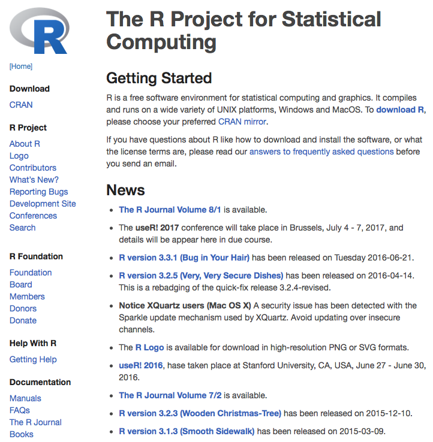
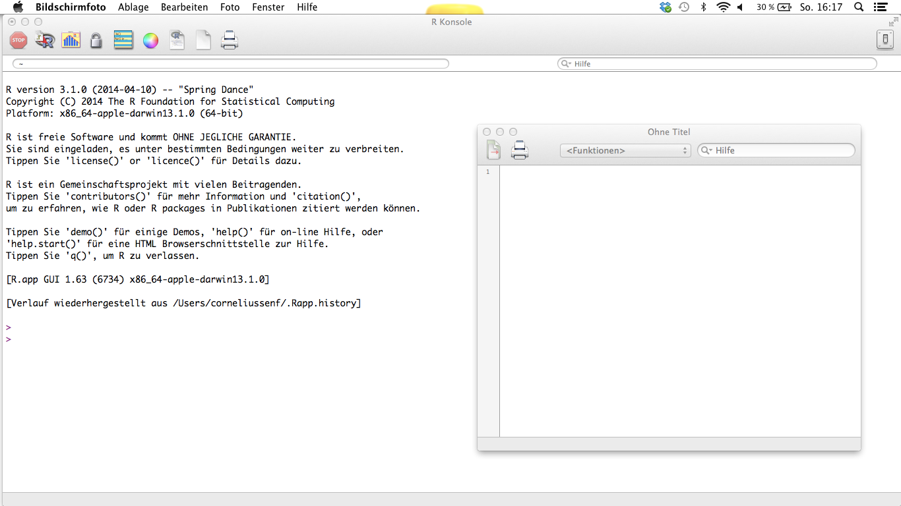
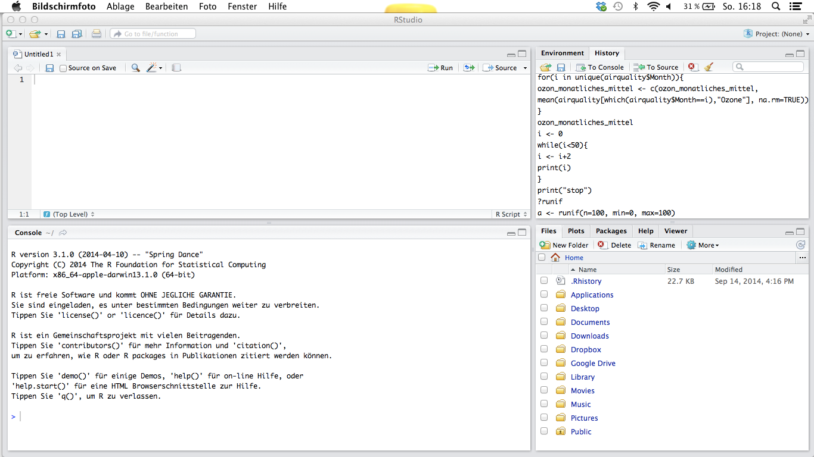

<style type="text/css">
slide.backdrop {
  background: none !important;
  background-color: white !important;
}
</style>

## Goals for this session:

Learn:

- How to get and run R
- R Syntax
- Arithmetic calculations and mathematical functions
- Data types and classes
- Data manipulation - Part 1

## Recommended reading

### Statistics

**Dormann, C. (2013)**. Parametrische Statistik: Verteilungen, maximum likelihood und GLM in R. Springer. (German).

**Bolker B. (2008)**. Ecological Models and Data in R. Princeton University Press.

**Zuur, A. (2007)**. Analyzing Ecological Data. Springer.

**McElreath, R. (2015)**. Statistical Rethinking. CRC Press.

### R

**Crawley, MJ (2012)**. The R Book. Wiley.

**Wickham, H (2014)**. Advanced R. CRC Press. http://adv-r.had.co.nz/

## What is R is and what does it do?

- A statistical programming language
    - write functions
    - analyse data
    - apply most available statistical techniques
    - create simple and complicated graphs
    - write your own library functions and algorithms
    - process spatial data
    - documents your research and makes it easer to reproduce
- Supported by a large user group (>1500 **Packages**)
- Often compared to Matlab and Python
- Open source
- Can be linked to other languages (C, Fortran, Python, Stan, etc.)

## Internet sources

- http://www.r-project.org/
- http://cran.r-project.org/
- https://cran.r-project.org/manuals.html
- http://de.wikibooks.org/wiki/GNU_R
- http://www.r-bloggers.com/

## Getting R (http://cran.r-project.org/)



## Classifical R Interface



## R-Studio (http://www.rstudio.com/)



## Citing R

```{r}
citation()
```

# First steps

## Following the examples of this session:

Please download the file `Script_Lab01.R` from Moodle and open it in R Studio.

## First steps

- R is a programming language
- You need to write instructions (**Code**)
- R code follows a certain **Syntax** (Grammar)
- R Code is executed by the R interpreter
- R can interpret code: 
    - interactively in the **Console** (command-line)
    - saved in a text file (**Skript**) and sent entirely to the R interpreter
    - Several IDE's allow sending individual lines or entire scripts to the console
- Many outputs are displayed in the Console
- Graphical outputs are displayed in a speparate window

## Syntax (Grammar)

- R is an expression language with a very simple syntax
- It is **case sensitive**, so **A** and **a** are different symbols and would refer to different variables
- All alphanumeric symbols are allowed as variable names plus ‘.’ and ‘_’ 
- However, a name must start with ‘.’ or a letter, and if it starts with ‘.’ the second character must not be a digit
- Names are effectively unlimited in length

## Expressions and assignments

If an expression is given as a command, it is evaluated, printed (unless specifically made invisible), and the value is lost. 

```{r}
2 + 5
```

An assignment also evaluates an expression and passes the value to a variable but the result is not automatically printed. The assignment operator is `<-` (“less than” and “minus”).

```{r}
a <- 2 + 5
```

## Expressions and assignments

If you enter the name of an existing variable into the console, its content will be printed to the console output.

```{r}
a
```

If you assign a new expression to an already existing variable, this variable will be overwritten.

```{r}
b <- 5
a <- a + b
a
```

## Comments

Comments can be put almost anywhere, starting with a hashmark (`#`).

Everything to the end of the line is a comment.

```{r}
# This is a comment
b <- 5 # this also
a <- a + b 
```

## List and remove objects

The entities that R creates and manipulates are known as **objects**. These may be variables, arrays of numbers, character strings, and functions. The collection of objects currently stored is called the **workspace**.

The function `ls()` can be used to display the names of objects in the workspace:

```{r}
ls()
```

The function `rm()` can be used to remove objects from the workspace:

```{r}
rm(b)
ls()
```

## Mathematical operators

There are several mathematical operators already implemented in R:

```{r}
a <- 7
b <- 5
c <- a * b + sqrt(a) - b^2 / log(2) * 1.34 * exp(b)
c
```

## Mathematical operators and functions

The elementary arithmetic operators are the usual `+`, `-`, `*`, `/` and `^` for raising to a power. 

In addition all of the common arithmetic functions are available, e.g.:

- `sqrt(x)`  : square root of x
- `exp(x)`   : antilog of x (e^x)
- `log(x, n)`   : log to base n of x (default n is e, natural log)
- `log10(x)` : log to base 10 of x
- `sin(x)`   : sine of x in radians
- `cos(x)`   : cosine of x in radians
- ...and more

## Data types

Objects can store different types of data, e.g. not only numbers but also text:

```{r}
d <- "hello world"
```

You can use the function `typeof()` to identify the *data type*:

```{r}
typeof(a)
typeof(d)
```

The most important data types are: **character**, **integer**, **double**, and **logical**

## Data types

R includes functions to set or change the data type:

```{r}
as.character(a)
as.integer("3.1")
as.double("3.1")
```

## Logical Operators

The **logical** data type can have `TRUE` and `FALSE` values (and `NA` for not available).

The logical data type is a result of evaluating a **condition**, e.g. by using logical operators:

```{r}
a == b  # is a equal to b ?
a < b   # is a less than b ?
a > b   # is a greater than b ?
```

## Logical Operators

You can combine logical operators (`==`, `<`, `<=`, `>`, `>=`, `!=`) or conditions with AND (`&`) or  OR (`|`):

```{r}
a != b
a != b & a < c
a < b | a < c
```

## Missing values

When an element or value is “not available” or a “missing value” in the statistical sense, a place within a vector may be reserved for it by assigning it the special value `NA`.

Any operation on an `NA` becomes an `NA`

```{r}
3 == NA
```

To evaluate if a variable contains a missing value use `is.na()`:
```{r}
is.na(3)
```


## Missing values

There is a second kind of “missing” values which are produced by numerical computation, the so-called Not a Number, `NaN`, values. 

```{r}
0 / 0
```

`is.na()` is `TRUE` both for `NA` and `NaN` values. To differentiate these, `is.nan()` is only `TRUE` for `NaN`s.

## Help

You can see the help for each R function using `?`:

```{r}
?is.nan()
```

You can even get help for help:

```{r}
?help
```

# R classes

## R classes

Multiple values can be stored in data structures, so called classes. There are five classes in R:

- vector
- factor
- matrix
- data frame
- list

You can determine the class of an objective with the function `class()`.

## Vectors

A vector is an ordered collection of values from a single data type.

Use `c()` to combine different values to a vector:

```{r}
x <- c(1, 3, 8, 12, 56, 875, 234, 13)
x
``` 

Use `length()` to determine the number of values in a vector:

```{r}
length(x)
```

## Vectors

You can construct vectors from each data type:

```{r}
y <- c("a", "b", "c")
typeof(y)
```

But you cannot mix data types. If you do, the simpler data type is used (**coercion**):

```{r}
z <- c(1, 4, "b", 8.5, "abc")
typeof(z)
```

The order is: Logical > Double > Integer > Character

## Vector arithmetic

Vectors can be used in arithmetic expressions, in which case the operations are performed element by element.

```{r}
x
x * 2
x + 2
```

## Vector arithmetic

If two vectors have different lengths, the shorter vector is **recyclelt** as often as needed:

```{r}
x <- c(1, 2, 3, 4, 5, 6, 7, 8)
x
x + c(1, 2)
x + c(1, 5, 1, 3)
```

## Numeric vector functions

- `max()`
- `min()`
- `sum()`
- `prod()`
- `length()`

```{r}
x
sum(x)
```

## Logical vectors

```{r}
x
x < 4
all(x < 4)
any(x < 4)
```

## Logical vectors

When arithmetic functions are applied to logical vectors, `TRUE` is treated as the number `1` and `FALSE` is treated as the number `0`. This can be very handy when counting the number of true  values.

```{r}
x
sum(x < 4)

```

## Generating sequence vectors

R includes helpful **functions** for generating sequences:

```{r}
1:10
15:5
seq(from = 1, to = 100, by = 10)
```

## Generating repeats

R includes helpful **functions** for generating repeats:

```{r}
rep("x", times=10)
rep(c("x", "o"), times=5)
rep(c("x", "o"), each=5)
```

## Accessing values of a vector

You can access the `i`'th value in a vector `x` by using its index `x[i]`:

```{r}
x <- c(1, 3, 8, 12, 56, 875, 234, 13)
x[1]
x[c(1, 5)]
x[c(1:4, 8)]
```

## Accessing values of a vector 

You can also index the vector using a logical vector:

```{r}
x <- c(1, 3, 8, 12, 56, 875, 234, 13)
x[c(TRUE, TRUE, TRUE, FALSE, FALSE, TRUE, TRUE, FALSE)]
```

However, if the logical vector is shorter then the recycling rule applies!

```{r}
x[c(TRUE, FALSE)]
```

## Removing values of a vector

You can remove values from a vector using negative indices:

```{r}
length(x)

x2 <- x[-3]
length(x2)
```

## Overwriting values of a vector

You can also overwrite individual values in a vector using indices:

```{r}
x[1] <- 5
x
```

## Factors

Factors are categorical variables that have a fixed number of **levels** (categories). They are mainly useful in statistical models. Recall statistical data types: continuous vs categorical (nominal vs ordinal).

Categorical (factor) variables are for example gender or tree species:

```{r}
treespecies <- factor(c("SP", "PI", "FI", "FI", "PI"))
treespecies
levels(treespecies)
```
 
## Factors

Levels are of data type `character`.

```{r}
typeof(levels(treespecies))
```

You can change the names of the levels (categories) as follows:
```{r}
levels(treespecies) <- c("Spruce", "Pine", "Fir")
treespecies
```

## Factors

Note, you cannot simply add values to a factor that are not specified in `levels`:

```{r}
treespecies[1] <- "Oak"
treespecies
```

## Matrices

A matrix is a two-dimensional **Array**. A matrix therefore has additional **attributes** specifiying the 2 dimensions: **nrow** und **ncol**.

```{r}
m <- matrix(1:9, nrow = 3, ncol = 3)
m
```

See: `dim(m)`, `nrow(m)`, `ncol(m)`

## Matrices

By default the columns of the matrix will be filled first.  If you want to fill the matrix by row, you can specify this with the `byrow` argument:

```{r}
n <- matrix(1:9, nrow = 3, ncol = 3, byrow = TRUE)
n
```

## Matrices

You can apply mathematical operators to matrices the same way as vectors (Attention: Recycling rule!): 

```{r}
m * 2
m * n
```

## Matrices

Like with vectors, you can access elements of a matrix with indices, except that we now deal with two dimensions `[i,j]` or `[row, column]`:

```{r}
m
m[1, ]
m[ , 1]
```

## Matrices

```{r}
m[1, 1]
m[1:2, 3]
m[1:2, c(1,3)]
```

## Matrices

When you exctract elements from a matrix, the result can belong to a different class!

```{r}
class(m)
class(m[ , 3])
```

## Matrices

The functions `cbind()` und `rbind()` glue (bind) vectors and matrices together:

```{r}
# bind together by column
cbind(m,n)
```

## Matrices

The function `cbind` und `rbind` glue (bind) vectors and matrices together:

```{r}
# bind together by row
rbind(m,n)
```

## Lists

Lists are objectes that can store values of different data type (and different objects):

```{r}
l <- list(c(1, 2, 3), m, "a")
```

To access the elements of a list with indices you need to use double brackets `[[]]`:

```{r}
l[[1]]
l[[3]]
```

## Why bother with lists now?

Nearly all functions (e.g., linear regression, generalised linear modelling, t-test, etc.) in R produce output that is stored in a list. The good news is that R contains various functions to extract required information (e.g., estimated values, p-values, etc.) and presents it in nice tables. However, sometimes it can be useful to extract information from the results directly OR you may want to use a list to return the output from your own functions.

## Lists

```{r}
class(l)
class(l[2])
class(l[[2]])
```

## Data frames

A data frame is what you may call a data table. It is similar to a two-dimensional matrix but the columns can contain different data types.

```{r}
df <- data.frame(TREEID = 1001:1003, 
                 SPECIES = factor(c("Spruce", "Fir", "Pine")), 
                 LIFE = c(TRUE, FALSE, TRUE),
                 HEIGHT = c(34, 21, 26)
                 )
df
```

## Data frames

The `summary()` function gives a quick overview. Helpful for spotting data entry errors and `NA`'s:

```{r}
summary(df)
```

## Data frames

You can index (access) columns using three main ways:

```{r}
df$TREEID
df[ , 1]
df[ , "TREEID"]
```

## Data frames

Rows are indexed by row number:

```{r}
df[3, ]
df[1:2, "TREEID"]
df[1, c("TREEID", "HEIGHT")]
```

## Data frames

IMPORTANT: Extracting a row does not change the class but, extracting a column does!

```{r}
class(df)
class(df[ 1, ])
class(df[ , "TREEID"])
```
