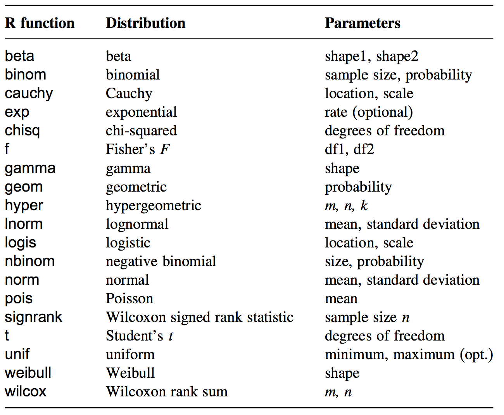

<style type="text/css">
slide.backdrop {
  background: none !important;
  background-color: white !important;
}
</style>

## Goals for this session:

- Distributions in R
- t-Test and F-Test
- OLS parameter estimation (recap)
- Plot a regression line

```{r echo=FALSE, hide=TRUE, message=FALSE, warning=FALSE}
library(ggplot2)
library(tidyverse)
```

# Distributions in R

## Distributions in R



## Distributions in R

Four fundamental items can be calculated for a statistical distribution:

- Density or point probability (abbreviated by `d`)
- Cumulated probability, distribution function (abbreviated by `p`)
- Quantiles (abbreviated by `q`)
- Pseudo-random numbers (abbreviated by `r`)

For all distributions implemented in R, there is a function for each of the four items listed above. For example, for the normal distribution, these are named `dnorm`, `pnorm`, `qnorm`, and `rnorm`.

## Probability distribution function

```{r}
x <- seq(-4, 4, length = 100)

normal_dist <- data.frame(x = x,
                          d1 = dnorm(x = x, mean = 0, sd = 1),
                          d2 = dnorm(x = x, mean = 0.5, sd = 2),
                          d3 = dnorm(x = x, mean = -1, sd = 0.5))

p <- ggplot(normal_dist) +
  geom_line(aes(x = x, y = d1), col = "blue") +
  geom_line(aes(x = x, y = d2), col = "red") +
  geom_line(aes(x = x, y = d3), col = "green") +
  labs(x = "x", y = "N(x)")
```

## Probability distribution function

```{r echo=FALSE, fig.width=4, fig.height=4, fig.align='center'}
print(p)
```

## Cummulative distribution function

```{r}
normal_dist <- normal_dist %>%
  mutate(p1 = pnorm(q = x, mean = 0, sd = 1),
         p2 = pnorm(q = x, mean = 0.5, sd = 2),
         p3 = pnorm(q = x, mean = -1, sd = 0.5))

p <- ggplot(normal_dist) +
  geom_line(aes(x = x, y = p1), col = "blue") +
  geom_line(aes(x = x, y = p2), col = "red") +
  geom_line(aes(x = x, y = p3), col = "green") +
  labs(x = "x", y = "Cummulative N(x)")
```

## Cummulative distribution function

```{r echo=FALSE, fig.width=4, fig.height=4, fig.align='center'}
print(p)
```

## Inverse cummulative distribution function

```{r}
z_95 <- qnorm(p = 0.95, mean = 0, sd = 1)

p <- ggplot(normal_dist) +
  geom_line(aes(x = x, y = p1), col = "blue") +
  geom_vline(xintercept = z_95) +
  labs(x = "x", y = "density")
```

## Inverse cummulative distribution function

```{r echo=FALSE, fig.width=4, fig.height=4, fig.align='center'}
print(p)
```

## Random draws

```{r}
random_normal <- data.frame(r1 = rnorm(n = 100, mean = 0, sd = 1),
                            r2 = rnorm(n = 100, mean = 0, sd = 1))

p <- ggplot(random_normal, aes(x = r1, y = r2)) +
  geom_point() +
  labs(x = "random draws", y = "random draws")
```

## Random draws

```{r echo=FALSE, fig.width=4, fig.height=4, fig.align='center'}
print(p)
```

# Null-hypothesis significance testing (NHST)

## Null-hypothesis significance testing (NHST)

Recall the yields data set:

```{r warning=FALSE, message=FALSE, fig.height=2, fig.width=2, fig.align='center'}
yields <- read.table("Data/yields.txt", sep = ";", header = TRUE)

yields %>% 
  gather(., key = soiltype, value = yield, -plotid) %>%
  ggplot(., aes(x = soiltype, y = yield)) +
  geom_boxplot()
```

Is the difference in yields between soiltypes meaningful?

## Formulating a null hypothesis

We might ask following question: Are the yields the same among loam and sand? To test this, we formulate a precise null hypothesis $H_{0}$: The yields are equal among both soiltypes, that is $\overline{x}_{loam} = \overline{x}_{sand}$; and a conguent alternative hypothesis $H_{A}$: The yields are not equal among both soiltypes, that is $\overline{x}_{loam} \ne \overline{x}_{sand}$. 

The principal idea behind NHST is to test how likely it would be to draw our sample at hand, assuming that $H_{0}$ is true. Hence, we want to know $P(D|H_{0})$. If $P(D|H_{0})$ is very small, we might safely reject $H_{0}$.

## t-Test

The NHST for two means is called a t-Test (or Student's t-test). The basic idea behind the t-test is that the difference between two sample means would be exact zero if they were the same. Hence, under the assumption of $H_{0}$, a large difference is very unlikely.

## t-Test

As measure of difference in sample means, which also incorporates the standard deviation, we make use of the empirical t-value:

$t = \sqrt{\frac{n_{sp1}*n_{sp2}}{n_{sp1}+n_{sp2}}}*\frac{\overline{x}_{sp1}-\overline{x}_{sp2}}{S}$

with $\overline{x}$ being the sample means, $n$ the sample size, and $S$ the weighted paired standard deviation defined as:

$S = \frac{(n_{sp1}-1)*s_{sp1}^{2}+(n_{sp2}-1)*s_{sp2}^{2}}{n_{sp1}+n_{sp2}-2}$

The probability that the empirical t-value deviates from zero, given $H_{0}$ is true, is described by a t-distribution, which has only one parameter, the degree of freedom: $v=n_{sp1}+n_{sp2}-2$.

## t-distribution

```{r echo=FALSE, results='asis', warning=FALSE, message=FALSE, fig.height=4, fig.width=10, fig.align='center'}
x <- seq(-6,6,length.out=10000)

set.seed(667)

d1 <- data.frame(t=x,
                v1=dt(x,1),
                v2=dt(x,4),
                v3=dt(x,10))
d1 <- reshape2::melt(d1, id.vars="t")
d1$variable <- factor(as.character(d1$variable),labels=c("STUT(1)","STUT(4)","STUT(10)"))

set.seed(667)

d2 <- data.frame(t=x,
                v1=pt(x,1),
                v2=pt(x,4),
                v3=pt(x,10))
d2 <- reshape2::melt(d2, id.vars="t")
d2$variable <- factor(as.character(d2$variable), labels=c("STUT(1)","STUT(4)","STUT(10)"))

gridExtra::grid.arrange(
  ggplot(d1, aes(x=t, y=value, col=variable)) +
    geom_line() +
    scale_color_brewer(palette="Set1") +
    ylab("STUT(t)") +
    ggtitle("PDF\n"),
  
  ggplot(d2, aes(x=t, y=value, col=variable)) +
    geom_line() +
    scale_color_brewer(palette="Set1") +
    ylab("Cummulative STUT(t)") +
    ggtitle("CDF\n"),
  
  ncol=2
)
```

## t-Test

Lets calculate the t-value, degrees of freedom, and p-value for our example:

```{r}
t.test(x = yields$loam, y = yields$sand, alternative = "two.sided", var.equal = TRUE)
```

The difference in sample means observed for our samples is very unlikely under the assumption of $H_{0}$ being true. We thus might safely reject $H_{0}$ and conclude that the mean yields are significantely different between both soiltypes.

## t-Test

What does the p-value tell us?

```{r}
t <- seq(-4, 4, length.out = 100) # Sequence of t-values
df <- nrow(yields) * 2 - 2 # Degrees of freedom: n1 + n2 - 2

t_dist <- data.frame(t = t,
                     p = pt(q = t, df = df))

t_crit <- qt(p = 0.95, df = df) # Critical t-value with p<0.05
t_emp <- 3.1375 # Empirical t-value extracted from t.test()

p <- ggplot(t_dist, aes(x = t, y = p)) +
  geom_line() +
  geom_vline(xintercept = t_crit, col = "red") +
  geom_vline(xintercept = t_emp, col = "blue") +
  labs(x = "t", y = "Cummulative STUT(t)")
```

## t-Test

```{r echo=FALSE, fig.width=4, fig.height=4, fig.align='center'}
print(p)
```

## t-Test

We can calculate the value of the cummulative distribution function (= sum under density curve) for our empirical $t$ using the `pt` function:

```{r}
df <- nrow(yields) * 2 - 2 # Degrees of freedom: n1 + n2 - 2
t_emp <- 3.1375 # Empirical t-value extracted from t.test()

p_value <- (1 - pt(q = t_emp, df = df)) * 2 # Calculate p-value
p_value
```

To obtain the p-value, we have to substract the value from 1, because we want all area under the curve outside the central 95% (the remaining 5%). Further, we have to multiply the value by 2, because we do a **two-tailed** test, that is the probability of our empirical value being more extreme in both directions: $Pr(t \leq -t)$ and $Pr(t \geq t)$, which is due to symmetry of $t$ equal to $2 * Pr(t \geq t)$.

## The p-value

The p-value is the most loved and hated value in science. Whole scientific disciplines build upon the p-value in drawing their conclusions from data, most often taking an abritrary threshold of $p<0.05$ as indication to reject $H_{0}$.

## The p-value

Even though the p-value has a clear definition ($P(D|H_{0})$), it is very often misinterpreted. Here are the commen pitfalls:

- The p-value does NOT tell you anything about the probability of the null hypothesis given your data ($P(H_{0}|D)$)
- It doesn't tell you anything about the alternative hypothesis
- The p-value is not a measure of effect size, that is it does NOT tell you anything about the strength of a difference
- There is NO mathematical proof behind thresholds indicating significe (such as $p<0.05$)
- A smaller p-value is NO indication that a difference is more important than one with a larger p-value

I you're interested in the abuse of p-values, please see: http://www.nature.com/news/statisticians-issue-warning-over-misuse-of-p-values-1.19503

## F-Test

The F-test aims at testing the difference in the variances between two samples. The null hypothesis $H_{0}$ is: The sample variances are equal $s^{2}_{loam} = s^{2}_{sand}$. The alternative hypothesis $H_{A}$ is: The sample variances are not equal $s^{2}_{loam} \ne s^{2}_{sand}$.

The test statistic is the F-value, calculated as the ratio of the sample variances: 

$F = \frac{s_{sp2}^{2}}{s_{sp1}^{2}}$. 

Assuming that $H_{0}$ is true, the F-value follows the F-distribution with two parameters:

$v_{sp1}=n_{sp1}-1$ and $v_{sp2}=n_{sp2}-1$.

## F-distribution

```{r echo=FALSE, results='asis', warning=FALSE, message=FALSE, fig.height=4, fig.width=10, fig.align='center'}
x <- seq(0,4,length.out=1000)

set.seed(667)

d1 <- data.frame(f=x,
                v1=df(x,2,2),
                v2=df(x,2,5),
                v3=df(x,10,10),
                v4=df(x,10,5))
d1 <- reshape2::melt(d1, id.vars="f")
d1$variable <- factor(as.character(d1$variable),labels=c("F(2,2)","F(2,5)","F(10,10)","F(10,5)"))

set.seed(667)

d2 <- data.frame(f=x,
                v1=pf(x,2,2),
                v2=pf(x,2,5),
                v3=pf(x,10,10),
                v4=pf(x,10,5))
d2 <- reshape2::melt(d2, id.vars="f")
d2$variable <- factor(as.character(d2$variable), labels=c("F(2,2)","F(2,5)","F(10,10)","F(10,5)"))

gridExtra::grid.arrange(
  ggplot(d1, aes(x=f, y=value, col=variable)) +
    geom_line() +
    scale_color_brewer(palette="Set1") +
    ylab("F(f)") +
    ggtitle("PDF\n"),
  
  ggplot(d2, aes(x=f, y=value, col=variable)) +
    geom_line() +
    scale_color_brewer(palette="Set1") +
    ylab("Cummulative F(f)") +
    ggtitle("CDF\n"),
  
  ncol=2
)
```

## F-Test

The F-Test can be easily calculated in R:

```{r}
var.test(x = yields$loam, y = yields$sand, alternative = "two.sided")
```

The probability of getting a F-value as extreme as the one observed is very likely under the assumption of $H_{0}$ being true. Hence, we cannot reject $H_{0}$ and thus cannot say that there are significant differences in variance between both soiltypes.

## Assumptions

Both tests, t-test and F-test, asume that the samples are normally distributed. The t-test moreover assumes equal variances for both samples, which you can adress using the Welch t-Test:

```{r}
t.test(x = yields$loam, y = yields$sand, alternative = "two.sided", var.equal = FALSE)
```

# Ordinary Least Squares (recap)

## Ordinary Least Squares

The linear regression model is given by:

$y_i = \beta_{0} + \beta_{1}x_i + \epsilon_i$

The nonrandom part of the equation describes the $y_i$ as lying on a straight line. The slope of the line (the regression coefficient) is $\beta_1$, the increase per unit change in $x$. The line intersects the y-axis at the intercept $\beta_0$.

## Ordinary Least Squares

The linear regression model is given by:

$y_i = \beta_{0} + \beta_{1}x_i + \epsilon_i$

The parameters $\beta_{0}$ and $\beta_{1}$ can be estimated using the method of ordinary least squares. OLS minimizes the residuals, in fact: the sum of squared residuals.

$SSE = \sum_{i=1}^{n}(y_{i} − \hat{y}_{i})^2$

where $\hat{y}_{i}$ is the estimate of $y_i$.

## Ordinary Least Squares

Finding the smallest least squares is not actually done by trial and error. One can find closed-form expressions for the choice of parameters that gives the smallest value of $SSE$ :


$SSX = \sum_{i=1}^{n}(x_{i}-\bar{x})^2$

$SSY = \sum_{i=1}^{n}(y_{i}-\bar{y})^2$

$SSXY = \sum_{i=1}^{n}(x_{i}-\bar{x})(y_{i}-\bar{y})$

$\beta_{1} = \frac{SSXY}{SSX}$

$\beta_{0} = \bar{y} - \beta_{1} * \bar{x}$

## ANOVA table

Is the linear regression of $x$ on $y$ statistically significant?

We test $H_0 :\beta_1 = 0$ against $H_A :\beta_1 \ne 0$.


| Source     |  Sum of Squares (SS) |  Degrees of freedom (df)  | Mean Squares (MS) |
|------------|:----------------:|:-------------------------:|:-----------------:|
| Regression |  $SSR = SSY-SSE$ | 1                         | $\frac{SSR}{1}$   |
| Error      |  $SSE$           | n-2                       | $\frac{SSE}{n-2}$ |
| Total      |  $SSY$           | n-1                       |                   |


F statistic and p-value:

$F_s =  \frac{MS_{regression}}{MS_{error}}$

$Pr(Z \ge  F_s) = 1-F(F_s, 1, n-2)$

## A simple regression model

```{r, echo=FALSE, results='asis', warning=FALSE, message=FALSE, fig.height=4, fig.width=4, fig.align='center'}
x <- c(0.142774142092094, 0.316857467638329, 0.0738065412733704, 0.0719271108973771, 
    0.0980032859370112, 0.151790785603225, 0.84363564895466, 0.402990009170026,     
    0.938224496087059, 0.248315626755357, 0.628750984324142, 0.950565603096038,     
    0.81698462064378, 0.730103035923094, 0.712243484565988, 0.177004434866831,      
    0.330815308261663, 0.337264955043793, 0.443428652128205, 0.268835727125406,     
    0.406888382975012, 0.884146957425401, 0.532588079338893, 0.178504134062678,     
    0.232083402574062) 


y <- c(-0.440492311511667, -0.0735368749994293, -0.859960344171456, -0.743824458596828, 
       -0.64070219748058, -1.07285402921956, 0.501539926105283,
      -0.312940382649315, 1.23244773284018, -0.134928197208915, 0.448658220494093,    
      1.00549448775604, 1.09018988458665, 0.450785089596242, 0.71501013756271,        
      -0.431530236485397, -0.390310491026423, -0.339787719167435, -0.161792394783762, 
      -0.35297130612154, -0.153988389472749, 0.938049434968332, 0.521399142740638,    
      -0.62642913830775, -0.167525585447361)  

dat <- data.frame(x=x, y=y)

ggplot(dat, aes(x = x, y = y)) +
  geom_point(size=2)
```

## Total sum of squares (SSY)

```{r, echo=FALSE, results='asis', warning=FALSE, message=FALSE, fig.height=4, fig.width=4, fig.align='center'}
xm <- mean(x) 
ym <- mean(y)
n <- length(x)

res.null <- data.frame(x = rep(x, each=2),
                  y = c(rbind(rep(ym, length(y)),y)),
                  group = rep(1:n, each=2))

ggplot(dat, aes(x = x, y = y)) +
  geom_point(size=2) +
  geom_hline(yintercept = ym, col='blue') +
  geom_line(data = res.null, aes(x = x, y = y, group = group), col='blue')
```

SSY represent the (total) variance of the response variable (times n-1): $SSY = \sum_{i=1}^{n}(y_{i}-\bar{y})^2$. Let's plot the $y_{i}-\bar{y}$ (vertical blue lines). The horizontal line is $\bar{y}$. You may also consider $\bar{y}$ as the Null model that assumes no effect of $x$ on $y$. Thus, the intercept of the Null model $\beta_0$ = $\bar{y}$ and the slope $\beta_1$ = 0.

## Residual sum of squares (SSE)

```{r, echo=FALSE, results='asis', warning=FALSE, message=FALSE, fig.height=4, fig.width=4, fig.align='center'}
xm <- mean(x) 
ym <- mean(y)
n <- length(x)
lmd <- lm(y ~ x)

res.lm <- data.frame(x = rep(x, each=2),
                   y = c(rbind(fitted(lmd), y)),
                   group = rep(1:n, each=2))


ggplot(dat, aes(x = x, y = y)) +
  geom_point(size=2) + 
  geom_abline(intercept=coefficients(lmd)[1], slope=coefficients(lmd)[2], col='red') + 
  geom_line(data = res.lm, aes(x = x, y = y, group = group), col='red') +
  geom_point(size=2)
```

The residual sum of squares $SSE = \sum_{i=1}^{n}(y_{i} − \hat{y}_{i})^2$.
Let's plot the $y_{i}-\hat{y}_i$ (vertical red lines). The diagonal red line is the fitted line: $\hat{y}_i$.

## Sum of squares of the regression (SSR)

```{r, echo=FALSE, results='asis', warning=FALSE, message=FALSE, fig.height=4, fig.width=4, fig.align='center'}
ggplot(dat, aes(x = x, y = y)) +
  geom_point(size=2) + 
  geom_hline(yintercept = ym, col='blue') +
  geom_line(data = res.null, aes(x = x, y = y, group = group), col='blue') + 
  geom_abline(intercept=coefficients(lmd)[1], slope=coefficients(lmd)[2], col='red') + 
  geom_line(data = res.lm, aes(x = x, y = y, group = group), col='red') +
  geom_point(size=2)
```

$SSR = SSY-SSE$

Is the sum of squares of the (vertical) blue lines larger than the sum of squares of the (vertical) red lines?

## Significance of regression

The SSE for our simple regression model is `r sum((y - fitted(lmd))^2)`, the mean squared error is `r sum((y - fitted(lmd))^2) / (length(y) - 2)` (with `r (length(y) - 2)` degrees of freedom), and the SSY is `r sum((y - mean(y))^2) - sum((y - fitted(lmd))^2)`. The resulting F-value is `r (sum((y - mean(y))^2) - sum((y - fitted(lmd))^2)) / (sum((y - fitted(lmd))^2) / (length(y) - 2))`.

Plotting the F-distribution and the F-value we get:

```{r}
f <- seq(0, 250, length.out = 100)
f_dist <- data.frame(f = f,
                     pf = pf(f, df1 = 1, df2 = 23))


t_emp <- 212.8974
t_crit <- qf(0.95, df1 = 1, df2 = 23)

p <- ggplot(f_dist, aes(x = f, y = pf)) +
  geom_line() +
  geom_vline(xintercept = t_emp, col = "red") +
  geom_vline(xintercept = t_crit, col = "blue") +
  labs(x = "f", y = "Cummulative F(f)")
```

## Significance of regression

```{r, echo=FALSE, results='asis', warning=FALSE, message=FALSE, fig.height=4, fig.width=4, fig.align='center'}
print(p)
```

## Significance of regression

The resulting p-value is:

```{r}
p_value <- 1 - pf(t_emp, df1 = 1, df2 = 23)
p_value
```

As the p-value is very small, we safely reject the null hypothesis $H_0 : \beta_1 = 0$, indicating a significant effect of $x$ on $y$. However, be aware that the p-value does not indicate the effect size! The effect size (change in $y$ with one unit change in $x$) is given by the regression slope ($\beta_1$).

# Plotting a regression line

## Plotting a regression line

Given the above shown example, we can plot $x$ versus $y$:

```{r}
dat[1:3, ]

p <- ggplot(dat, aes(x = x, y = y)) +
  geom_point()
```

## Plotting a regression line

```{r, echo=FALSE, results='asis', warning=FALSE, message=FALSE, fig.height=4, fig.width=4, fig.align='center'}
print(p)
```

## Plotting a regression line

Using OLS we calculated the slope ($\beta_{1} = 2.1206$) and intercept ($\beta_{0} = -0.9262$). We can plot the resulting OLS line using `geom_abline()` in `ggplot2`:

```{r}
p <- ggplot(dat, aes(x = x, y = y)) +
  geom_point() +
  geom_abline(intercept = -0.9262, slope = 2.1206, col = "red")
```

## Plotting a regression line

```{r, echo=FALSE, results='asis', warning=FALSE, message=FALSE, fig.height=4, fig.width=4, fig.align='center'}
print(p)
```
